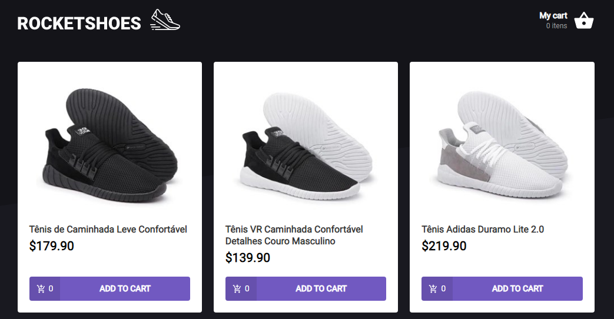

# RockeShoes




> Project developed in the Rocketseat ignite course to challenge the creation of a custom hook.

RocketShoes is a project created carry the task of a custom hook, in this project we've developed a custom ReactJS hook called useCart that has a fully functional and operational shopping cart behind, with some features like: Adding items to cart, removing items, changing items quantity, calculating real time expenses, listing the quantity of produts and inventory management.

### Fixed and upgrades

This project is fully developed and properly working but it could have some changes:

- [x] Inventory check
- [x] Cart saves to localStorage
- [x] Add, update and remove items from cart
- [x] Real time calculation
- [x] Custom ReactJS Hook
- [ ] Update by more than one on cart
- [ ] Discount area

## ✨ Live Project

The project is live and working! You can check it out here:

[https://lamongabriel-rocketshoes.netlify.app/](https://lamongabriel-rocketshoes.netlify.app/)

## 💻 Prerequisites

Before going on, make sure you have the most recent versions of the following packages:

- NodeJS
- NPM

## 🚀 Installing <ROCKETSHOES>

To use it just run:

Linux, macOS and Windows:

```
git clone https://github.com/lamongabriel/rocketseat-ignite-rocketshoes.git
cd /rocketseat-ignite-rocketshoes/
yarn
yarn start
```

You also need to change the api route to your localhost port. In order to do that, go to `/services/api.ts`. Then change `/baseURL: 'https://lamongabriel-rocketshoes.netlify.app/'` to your local adress, the default one is `http://localhost:3000/api`.

## ☕ Usage <DT_MONEY>

Check out the custom hook in the folder hooks, or use the website to see it performing. Adding products, removing them and updating

## 💡 Technologies

This project was developed using severous technologies to help organize, maintain and develop it.

- ReactJS
- TypeScript
- Styled Components
- Polished
- Axios
- MirageJS
- HTML, CSS and JS
